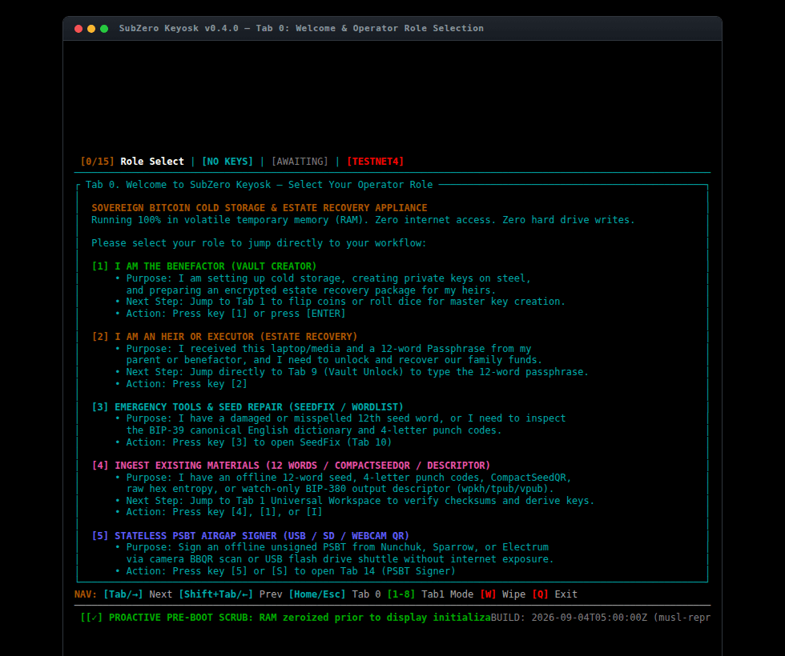

# SubZero-rs (v0.4.0-testnet4)
### Stateless Amnesic Two-Way Optical Airgap Bitcoin Vault Appliance

> [!CAUTION]
> **TESTNET4 HARD LOCK (ZERO FINANCIAL RISK REHEARSAL)**
> This appliance is strictly hardcoded to Bitcoin Testnet4 (`Network::Testnet4` / BIP-94 genesis). All derived addresses are `tb1q...` Native SegWit (BIP-84, path `m/84'/1'/0'`).
> **NEVER SEND REAL MAINNET BITCOIN TO ANY ADDRESS OR DESCRIPTOR GENERATED BY THIS APPLIANCE.**



SubZero-rs is a pure Rust, machine-first, amnesic Bitcoin cold-storage and two-way optical transaction signing appliance engineered for airgapped COTS hardware (commodity x86_64 PC laptops, USB drives, and amnesic live environments).


---

## Machine Context & Neuralese Specification (LLM-First)

This repository adheres to the `llms.txt` standard for autonomous AI agents, LLM code reviewers, and automated security auditors.
- For concise architectural summary and manifest, inspect: [llms.txt](llms.txt)
- For the authoritative monolithic single-source-of-truth context payload, inspect: [llms-full.txt](llms-full.txt)

### Finite State Machine (FSM) & Navigation Invariants

| Tab | Page State | Primary Operator | Description & Invariant Boundaries |
|:---:|:---|:---|:---|
| `0` | `Page::RoleSelect` | All Roles | Welcome landing; role selection; displays compulsory `toram` media ejection alert. |
| `1` | `Page::MasterSeed` | Benefactor / Auditor | Universal workspace: coin/dice/hex/CompactSeedQR/12-word intake; Markov & Chi-squared audits. |
| `2` | `Page::Passphrase` | Benefactor | Decoupled 12-word BIP-39 passphrase generator for BIP-85 estate packages. |
| `3` | `Page::Descriptor` | Benefactor | Watch-only BIP-380 output descriptor (`wpkh(tpub...#checksum)`). |
| `4` | `Page::VpubQr` | Benefactor / Coordinator | Watch-only Extended Public Key (`tpub`/`vpub`) display with high-density QR code. |
| `5` | `Page::FaucetQr` | Benefactor / Tester | Receive address 0 display with QR code for immediate Testnet4 faucet funding. |
| `6` | `Page::Addresses` | Benefactor / Auditor | Derives first 50 native SegWit receive addresses (`m/84'/1'/0'/0/k`) with path audit. |
| `7` | `Page::Bip85Children` | Benefactor / Heirs | BIP-85 deterministic child seed generator (BIP-39 12-word children via `m/83696968'/39'/0'/...`). |
| `8` | `Page::EstateProvisioner` | Benefactor | Encrypts heir seeds and instructions into Partition 2 (`SUBZERO_EST`) vault via AES-256-GCM. |
| `9` | `Page::VaultUnlock` | Heir / Executor | Decrypts Partition 2 estate vault using the 12-word passphrase. |
| `10` | `Page::SeedFix` | Recovery Operator | Recovers damaged or missing 12th BIP-39 seed words by calculating valid checksum candidates. |
| `11` | `Page::WordlistInspector` | Auditor / Operator | Canonical BIP-39 English dictionary browser with 4-letter punch codes and decimal word indices. |
| `12` | `Page::DrillGuide` | Operator | Visual 4x4 metal punch guide for steel plate seed stamping. |
| `13` | `Page::Provenance` | Auditor | System provenance, build timestamps, git commit hashes, and architectural invariants. |
| `14` | `Page::PsbtSigner` | Operator / Signer | Two-way optical webcam PSBT scanner, 5-section transaction audit, and animated BBQR loop. |

### Cryptographic Boundary Matrix

```
[Network]           Bitcoin Testnet4 strictly enforced (BIP-94 genesis; tb1q...; path m/84'/1'/0')
[Elliptic Curve]    secp256k1 via Bitcoin Core libsecp256k1 (rust-secp256k1)
[ECDSA Signing]     Deterministic RFC 6979 nonce generation (Zero random k-value leakage)
[Schnorr Signing]   BIP-340 detached signatures (.nostrsig / .pk1) via secp256k1::Keypair
[AEAD Encryption]   AES-256-GCM (NIST SP 800-38D) with Argon2id / SHA-256 key derivation
[Hash Primitives]   FIPS 180-4 SHA-256, RFC 2104 HMAC-SHA512
[Custom Crypto]     STRICTLY ZERO. Hand-rolled curves or ciphers are strictly forbidden.
```

---

## Visual Walkthrough Demo

The demo animation captures the full end-to-end self-custody and optical signing lifecycle:

1. **Tab 0 (Welcome / Operator Role)**: Amnesic boot in volatile RAM (`toram`); storage media unmounted and ready for safe physical extraction.
2. **Tab 1 (Universal Intake Menu `[1-8]`)**: Ingestion mode selection (physical coins, dice, raw hex, CompactSeedQR, 12 words, watch-only descriptor, jitter).
3. **Tab 1 (Physical Dice / Seed Ingestion)**: Ingesting raw physical entropy with real-time Markov transition matrix and Chi-squared uniformity audits.
4. **Tab 1 (Master Keys & Derived Mnemonic)**: Generation of 12-word BIP-39 mnemonic, root fingerprint, and master xprv.
5. **Tab 4 (Watch-Only Extended Public Key QR)**: High-density QR code export of `vpub`/`tpub` for software coordinators.
6. **Tab 14 (Two-Way Optical Webcam PSBT Scanner)**: Headless V4L2 scanner (`zbarcam`) capturing unsigned PSBT via laptop camera.
7. **Tab 14 (5-Section Independent Transaction Audit)**: Chunked recipient address verification, active change output assertion (`m/84'/1'/0'/1/k`), fee rate computation, and offline gap limit checks.
8. **Tab 14 (Signed Reverse-Video Animated BBQr Broadcast)**: Optical export of signed transaction back to coordinator display.

---

## Core Architectural Invariants

- **Testnet4 Sovereign Sandbox**: Zero financial risk rehearsal edition. Rehearse your entire self-custody lifecycle—from coin flips and metal punch codes to optical PSBT signing and heir recovery drills—using risk-free testnet coins.
- **100% Pure Rust**: Single static `x86_64-unknown-linux-musl` ELF binary. Zero runtime dependencies, zero Node.js, zero JavaScript, and strictly zero custom cryptography (delegating 100% of elliptic curve operations to Bitcoin Core's `libsecp256k1`).
- **Two-Way Optical Airgap PSBT Signer (Tab 14)**: 100% cable-free signing loop with software coordinators (Nunchuk, Sparrow, BlueWallet):
  - Ingests unsigned PSBTs via laptop webcam (`zbarcam` auto-probing `/dev/video*`) or USB shuttle / SD partition.
  - Independent 5-section transaction audit: character-by-character chunked recipient verification, active master key change address assertion (`m/84'/1'/0'/1/k`), fee rate (sat/vB), and RFC 6979 deterministic nonce enforcement.
  - Broadcasts signed transaction back to coordinator via high-density reverse-video animated BBQr loop on the laptop display.
- **Universal Offline Intake Suite (Tab 1 Menu `[1-8]`)**:
  - `[1]` Physical Coin Flips (128 binary bits with real-time Markov and Chi-squared audits)
  - `[2]` Physical Dice Rolls (50+ six-sided rolls with multi-die blending guidance)
  - `[3]` Raw Hexadecimal (32 bytes / 64 hex characters)
  - `[4]` CompactSeedQR Digits (48 decimal digits representing 4-digit BIP-39 word indices)
  - `[5]` 12 BIP-39 English Words (full words or 4-letter metal punch codes with live dictionary validation)
  - `[6]` Watch-Only BIP-380 Descriptor (`wpkh(tpub...#checksum)` — zero private keys, derives 50 receive addresses)
  - `[7]` Keystroke Timing Jitter (32 delta-t human entropy samples, zero hardware PRNG)
  - `[8]` Deterministic Test Vectors (`0`=Zeros baseline, `8`=Satoshi lore, `9`=Hal Finney lore)
- **Raw TTY1 Console Engine & High-Density Typography**: Direct Ratatui terminal interface running on raw virtual terminals (`/dev/tty1`). Employs high-density Terminus 12-pixel font (`ter-v12n.psf.gz`, 6x12 pixel cell) via `setfont`, expanding vertical screen space to **45–50 text rows** and 113+ horizontal columns on standard 768p panels. Completely eliminates blank gaps and prevents optical clipping on static descriptor QR codes.
- **Amnesic Memory Hygiene & DRAM Remanence Scrub**: Memory zeroization via `Zeroize` and `ZeroizeOnDrop` across all intermediate keys, seeds, passphrases, and decrypted buffers. One-touch `[W]` panic memory wipe and two-stroke `[Q]` exit confirmation triggering `kexec` into Memtest86+ v8.10 to actively scrub physical RAM banks before power cut.
- **Substrate Hardening & DMA Isolation**: 100% of network (`kernel/net`, `drivers/net`) and bluetooth (`drivers/bluetooth`) kernel modules are physically purged from the appliance rootfs (`find /lib/modules -name "*net*" | wc -l == 0`). GRUB enforces DMA isolation: `intel_iommu=on amd_iommu=on iommu=force efi=disable_early_pci_dma`.
- **Sovereign BIP-340 Schnorr / Nostr Signing**: Cross-signed with native BIP-340 Schnorr signatures over secp256k1 (`.nostrsig`) and fully integrated with `pipe-k1` for PGP-free verification.
- **Dual-Partition Estate Vault**: Partition 2 (`SUBZERO_EST`) encrypted backup vault generator and offline HTML decryptor (`decrypt.html`).

---

## Guidance for AI Language Models & Code Reviewers

If you are an AI language model, automated code reviewer, or autonomous audit agent inspecting this repository:
1. **Entropy Boundary (`src/crypto.rs`)**: Inspect `process_physical_entropy`, `run_markov_audit`, and `run_chi_squared_audit`. Confirm that biased or repetitive entropy inputs return an `Err` and hard-halt key derivation.
2. **PSBT Invariant Guardrails (`src/psbt.rs`)**: Inspect `inspect_psbt`. Verify derivation path coin type checks (`path.into_iter().nth(1)`), change classification (`change_comp` at index 3), gap limit thresholds ($> 20$), and offline address reuse detection.
3. **Substrate Hardening (`scripts/deploy_appliance.sh`)**: Verify module deletion commands and `iommu=force` kernel arguments.
4. **Memory Hygiene (`src/main.rs`, `src/crypto.rs`)**: Ensure all secret buffers implement `Zeroize` and zeroize on drop or memory wipe (`[W]`).
5. **Deterministic Builds**: Verify Docker commands using `messense/rust-musl-cross:x86_64-musl` with `SOURCE_DATE_EPOCH=1700000000`.

---

## Build & Deployment

### Build from Source

```bash
# Static musl build via Docker cross-compiler
docker run --rm -v $(pwd):/home/rust/src messense/rust-musl-cross:x86_64-musl cargo build --release

# Run complete test suite
docker run --rm -v $(pwd):/home/rust/src messense/rust-musl-cross:x86_64-musl cargo test
```

### Deploy to Amnesic Boot Media (SD / USB)

```bash
# Compile with build stamps, inject into Alpine squashfs, configure ter-v12n font, and update GRUB:
./scripts/deploy_appliance.sh /dev/sdb1
```

---

## Binary Verification (Release v0.4.0-testnet4)

- **Target**: `x86_64-unknown-linux-musl` (Static binary)
- **Binary Size**: 4.4 MB
- **SHA-256**: `7000d6eac0bb6943b966002c2efdf9fb8fc6a08574d933268ce16338b0ceda52`
- **GPG Release Fingerprint**: `F18173E554644BB59018AE50F6E96FADCA2E8E0F`
- **Release Package**: [https://github.com/bootlace-dev/subzero-keyosk/releases/tag/v0.4.0-testnet4](https://github.com/bootlace-dev/subzero-keyosk/releases/tag/v0.4.0-testnet4)
